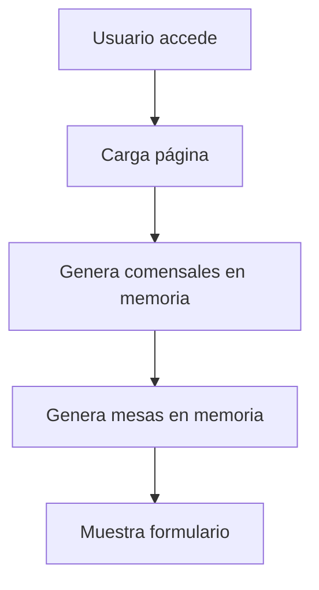
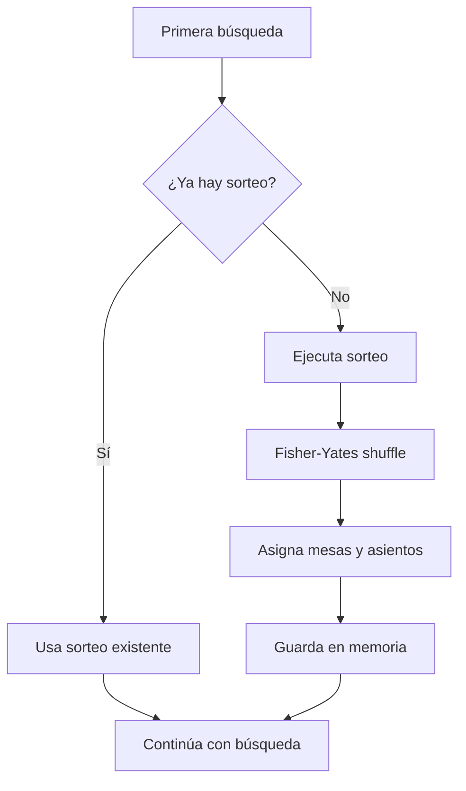
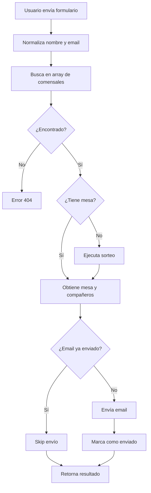
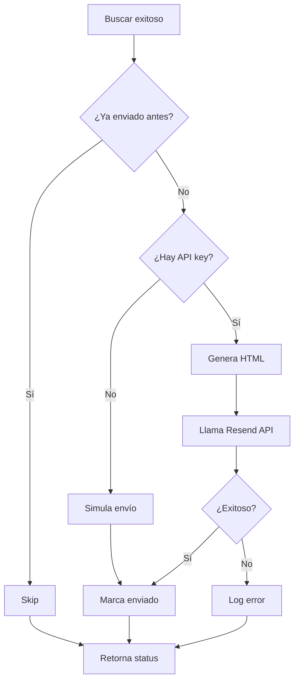

# 📚 Documentación Completa - Sistema de Sorteo de Mesas

**Proyecto:** Sistema de Sorteo de Mesas para Cena de Gala
**Versión:** 1.0.0
**Fecha:** 2024-12-26
**Stack:** Next.js 15 + React 19 + TypeScript + Tailwind CSS
**Repositorio:** https://github.com/RicardoGestiona/mesas-cena-agente

---

## 📋 Índice

1. [Visión General](#visión-general)
2. [Arquitectura](#arquitectura)
3. [Estructura del Proyecto](#estructura-del-proyecto)
4. [Modelo de Datos](#modelo-de-datos)
5. [Flujo de Operación](#flujo-de-operación)
6. [Componentes Frontend](#componentes-frontend)
7. [API Routes](#api-routes)
8. [Lógica de Negocio](#lógica-de-negocio)
9. [Sistema de Emails](#sistema-de-emails)
10. [Configuración y Deployment](#configuración-y-deployment)
11. [Testing](#testing)
12. [Troubleshooting](#troubleshooting)

---

## 🎯 Visión General

### Propósito
Aplicación web para organizar el sorteo aleatorio de ubicaciones en una cena de gala con 400 comensales distribuidos en 40 mesas de 10 personas cada una.

### Problema que Resuelve
- **Sorteo justo:** Distribución 100% aleatoria garantizada
- **Información instantánea:** Los comensales consultan su ubicación al instante
- **Comunicación automática:** Envío de email con toda la información al consultar
- **Visualización clara:** Croquis de sala y mesa para ubicación fácil
- **Sin duplicados:** Control automático de emails enviados

### Características Principales
1. ✅ Generación determinista de 400 comensales con datos realistas
2. ✅ Sorteo aleatorio usando algoritmo Fisher-Yates
3. ✅ Búsqueda por nombre y email
4. ✅ Visualización interactiva de sala (8×5 mesas)
5. ✅ Visualización de mesa circular con 10 asientos
6. ✅ Envío automático de email al consultar
7. ✅ Control de duplicados (no reenvía emails)
8. ✅ Modo simulación sin API key

---

## 🏗️ Arquitectura

### Stack Tecnológico

```
┌─────────────────────────────────────────┐
│           FRONTEND LAYER                │
│  Next.js 15 (App Router) + React 19    │
│  TypeScript + Tailwind CSS              │
│  Lucide React (iconos)                  │
└─────────────────────────────────────────┘
                    ↓
┌─────────────────────────────────────────┐
│           API LAYER                     │
│  Next.js API Routes                     │
│  - /api/buscar (búsqueda + email)      │
│  - /api/sorteo (ejecutar sorteo)       │
│  - /api/enviar-email (individual)      │
│  - /api/enviar-emails-masivo (batch)   │
└─────────────────────────────────────────┘
                    ↓
┌─────────────────────────────────────────┐
│        BUSINESS LOGIC LAYER             │
│  src/lib/data.ts                        │
│  - Generación de comensales             │
│  - Algoritmo de sorteo                  │
│  - Control de duplicados                │
└─────────────────────────────────────────┘
                    ↓
┌─────────────────────────────────────────┐
│         EXTERNAL SERVICES               │
│  Resend API (envío de emails)           │
└─────────────────────────────────────────┘
```

### Principios de Diseño

1. **Simplicidad:** Una sola página, flujo lineal
2. **Estado en memoria:** No requiere base de datos para funcionalidad básica
3. **Determinismo:** Mismos datos en cada ejecución (reproducible)
4. **Graceful degradation:** Funciona sin API key (modo simulación)
5. **Responsive:** Mobile-first design

---

## 📁 Estructura del Proyecto

```
mesas-cena-agente/
├── src/
│   ├── app/                      # Next.js App Router
│   │   ├── api/                  # API Routes
│   │   │   ├── buscar/
│   │   │   │   └── route.ts      # POST: Búsqueda + envío email
│   │   │   ├── sorteo/
│   │   │   │   └── route.ts      # POST: Ejecutar sorteo
│   │   │   ├── enviar-email/
│   │   │   │   └── route.ts      # POST: Email individual
│   │   │   └── enviar-emails-masivo/
│   │   │       └── route.ts      # POST: Email masivo (legacy)
│   │   ├── page.tsx              # Página principal
│   │   ├── layout.tsx            # Layout global
│   │   └── globals.css           # Estilos globales
│   │
│   ├── components/               # Componentes React
│   │   ├── SalaCroquis.tsx       # Visualización sala (40 mesas)
│   │   ├── MesaCroquis.tsx       # Visualización mesa circular
│   │   └── CompanerosList.tsx    # Lista de compañeros
│   │
│   ├── lib/                      # Lógica de negocio
│   │   ├── data.ts               # Core: sorteo, búsqueda, control
│   │   └── utils.ts              # Utilidades (cn)
│   │
│   └── types/                    # Definiciones TypeScript
│       └── index.ts              # Tipos principales
│
├── config.ts                     # Configuración app (legacy)
├── package.json                  # Dependencias
├── tsconfig.json                 # Config TypeScript
├── tailwind.config.ts            # Config Tailwind
├── next.config.ts                # Config Next.js
├── .env.local.example            # Ejemplo variables entorno
├── .gitignore                    # Archivos ignorados
├── README.md                     # Documentación usuario
├── CRON_SETUP.md                 # Guía cron (legacy)
├── DOCUMENTATION.md              # Este archivo
└── test-email.sh                 # Script testing (legacy)
```

### Responsabilidades por Carpeta

#### `src/app/`
- **Responsabilidad:** Routing y páginas
- **Convención:** App Router de Next.js 15
- **Client/Server:** `page.tsx` es client component (`'use client'`)

#### `src/app/api/`
- **Responsabilidad:** Endpoints HTTP
- **Convención:** Cada carpeta = ruta, `route.ts` = handler
- **Formato:** Exporta funciones HTTP (GET, POST, etc.)

#### `src/components/`
- **Responsabilidad:** Componentes reutilizables de UI
- **Convención:** Client components, un componente por archivo
- **Props:** TypeScript interfaces en el mismo archivo

#### `src/lib/`
- **Responsabilidad:** Lógica de negocio y utilidades
- **Convención:** Funciones puras, exportadas
- **Estado:** `data.ts` mantiene estado en memoria (variables privadas)

#### `src/types/`
- **Responsabilidad:** Definiciones de tipos compartidas
- **Convención:** Interfaces y tipos TypeScript
- **Exports:** Named exports, no default

---

## 🗂️ Modelo de Datos

### Entidades Principales

#### `Comensal`
```typescript
interface Comensal {
  id: number;                 // ID único (1-400)
  nombre: string;             // Nombre de pila
  apellido: string;           // Apellido
  email: string;              // Email único sin acentos
  mesa_id: number | null;     // ID de mesa asignada (null = sin asignar)
  asiento: number | null;     // Número de asiento (1-10, null = sin asignar)
  created_at: string;         // Timestamp ISO 8601
}
```

**Invariantes:**
- `id` es único y consecutivo (1-400)
- `email` es único y sin acentos
- Si `mesa_id` no es null, `asiento` tampoco lo es
- `asiento` está en rango 1-10

#### `Mesa`
```typescript
interface Mesa {
  id: number;           // ID único (1-40)
  numero: number;       // Número de mesa (1-40, mismo que id)
  capacidad: number;    // Siempre 10
  posicion_x: number;   // Columna en la sala (1-8)
  posicion_y: number;   // Fila en la sala (1-5)
}
```

**Invariantes:**
- `id` === `numero` (siempre iguales)
- `capacidad` siempre es 10
- `posicion_x` en rango 1-8
- `posicion_y` en rango 1-5

#### `BusquedaFormData`
```typescript
interface BusquedaFormData {
  nombre: string;    // Nombre o apellido a buscar
  email: string;     // Email exacto
}
```

#### `AsignacionMesa`
```typescript
interface AsignacionMesa {
  comensal: Comensal;      // Comensal encontrado
  mesa: Mesa;              // Su mesa asignada
  companeros: Comensal[];  // Compañeros en la misma mesa
}
```

### Distribución de Datos

#### Comensales
- **Total:** 400 comensales
- **Generación:** Determinista (nombres × apellidos)
- **Nombres:** 64 nombres españoles comunes
- **Apellidos:** 56 apellidos españoles comunes
- **Emails:** Formato `nombre.apellidoN@email.com` (sin acentos)

#### Mesas
- **Total:** 40 mesas
- **Layout:** 8 columnas × 5 filas
- **Capacidad:** 10 personas cada una
- **Numeración:** 1-40 (izquierda a derecha, arriba a abajo)

```
Layout de la sala:

        ESCENARIO
     ═══════════════════

     [01] [02] [03] [04] [05] [06] [07] [08]
     [09] [10] [11] [12] [13] [14] [15] [16]
     [17] [18] [19] [20] [21] [22] [23] [24]
     [25] [26] [27] [28] [29] [30] [31] [32]
     [33] [34] [35] [36] [37] [38] [39] [40]

     ═══════════════════
            ↑ ENTRADA
```

---

## 🔄 Flujo de Operación

### 1. Inicialización de la Aplicación



**Código:** `src/lib/data.ts` → `getComensales()`, `getMesas()`

### 2. Sorteo Automático



**Algoritmo:** Fisher-Yates shuffle
**Complejidad:** O(n) donde n = 400
**Resultado:** Distribución uniforme garantizada

### 3. Búsqueda de Comensal



**Endpoint:** `POST /api/buscar`
**Input:** `{ nombre: string, email: string }`
**Output:** `{ comensal, mesa, companeros, todasLasMesas, emailEnviado }`

### 4. Envío de Email



**Control de duplicados:** Set en memoria (`_emailsEnviados`)
**Persistencia:** No (se pierde al reiniciar servidor)

---

## 🎨 Componentes Frontend

### `src/app/page.tsx` - Página Principal

**Tipo:** Client Component
**Estado:**
- `nombre: string` - Input de búsqueda
- `email: string` - Input de búsqueda
- `loading: boolean` - Loading state
- `error: string` - Mensaje de error
- `resultado: AsignacionMesa | null` - Datos del comensal encontrado
- `mesas: Mesa[]` - Todas las mesas para el croquis

**Funciones:**
- `handleSubmit()` - Maneja envío del formulario
- `fetch("/api/buscar")` - Llama API de búsqueda

**Estructura:**
```tsx
<main>
  <Header />
  <FormularioBusqueda />
  {error && <ErrorMessage />}
  {resultado && (
    <>
      <InfoComensal />
      <SalaCroquis />
      <MesaCroquis />
      <CompanerosList />
    </>
  )}
</main>
```

### `src/components/SalaCroquis.tsx`

**Props:**
```typescript
interface SalaCroquisProps {
  mesas: Mesa[];           // Todas las mesas
  mesaResaltada: number;   // Número de mesa a resaltar
}
```

**Responsabilidad:** Renderiza grid 8×5 con todas las mesas

**Lógica:**
1. Genera array de 40 posiciones
2. Para cada posición, verifica si es la mesa resaltada
3. Aplica estilos condicionales (escala, color, anillo)

**Estilos:**
- Mesa resaltada: `bg-amber-500`, `ring-4`, `scale-110`
- Otras mesas: `bg-white/20`
- Escenario arriba, entrada abajo

### `src/components/MesaCroquis.tsx`

**Props:**
```typescript
interface MesaCroquisProps {
  asientoUsuario: number;  // Número de asiento del usuario
  companeros: Comensal[];  // Lista de compañeros
}
```

**Responsabilidad:** Renderiza mesa circular con 10 asientos

**Lógica:**
1. Calcula posición polar de cada asiento: `angle = (n-1) * 36° - 90°`
2. Convierte a coordenadas cartesianas: `x = 50 + radius * cos(angle)`
3. Posiciona absolutamente cada asiento

**Estilos:**
- Asiento usuario: `bg-amber-500`, `ring-4`, `scale-110`
- Otros asientos: `bg-white/30`
- Mesa central: gradiente marrón ámbar

### `src/components/CompanerosList.tsx`

**Props:**
```typescript
interface CompanerosListProps {
  companeros: Comensal[];  // Lista de compañeros
}
```

**Responsabilidad:** Lista los compañeros con avatar y asiento

**Lógica:**
1. Ordena por número de asiento
2. Renderiza grid responsive (1 columna móvil, 2 en desktop)
3. Cada item muestra avatar, nombre y asiento

**Estilos:**
- Avatar: gradiente morado-rosa, icono de usuario
- Hover: `bg-white/10`
- Truncate para nombres largos

---

## 🔌 API Routes

### `POST /api/buscar`

**Archivo:** `src/app/api/buscar/route.ts`

**Request:**
```json
{
  "nombre": "María",
  "email": "maria.garcia1@email.com"
}
```

**Response (200):**
```json
{
  "comensal": {
    "id": 1,
    "nombre": "María",
    "apellido": "García",
    "email": "maria.garcia1@email.com",
    "mesa_id": 15,
    "asiento": 3,
    "created_at": "2024-12-26T..."
  },
  "mesa": {
    "id": 15,
    "numero": 15,
    "capacidad": 10,
    "posicion_x": 7,
    "posicion_y": 2
  },
  "companeros": [ /* array de 9 comensales */ ],
  "todasLasMesas": [ /* array de 40 mesas */ ],
  "emailEnviado": true
}
```

**Errores:**
- 400: Nombre o email faltantes
- 404: Comensal no encontrado
- 500: Error interno

**Flujo:**
1. Valida input
2. Ejecuta sorteo si es primera vez
3. Busca comensal (normaliza acentos, case-insensitive)
4. Obtiene mesa y compañeros
5. Envía email si no se ha enviado antes
6. Marca email como enviado
7. Retorna resultado

### `POST /api/sorteo`

**Archivo:** `src/app/api/sorteo/route.ts`

**Request:** `{}` (sin body)

**Response (200):**
```json
{
  "success": true,
  "message": "Sorteo realizado exitosamente",
  "asignaciones": 400
}
```

**Responsabilidad:** Ejecuta sorteo manualmente (normalmente se hace automático)

### `POST /api/enviar-email`

**Archivo:** `src/app/api/enviar-email/route.ts`

**Request:**
```json
{
  "comensal": { /* objeto Comensal */ },
  "mesa": { /* objeto Mesa */ },
  "companeros": [ /* array de comensales */ ]
}
```

**Response (200):**
```json
{
  "success": true
}
```

**Responsabilidad:** Envía email individual (legacy, ahora integrado en /buscar)

### `POST /api/enviar-emails-masivo`

**Archivo:** `src/app/api/enviar-emails-masivo/route.ts`

**Status:** Legacy, ya no se usa

**Responsabilidad:** Envío masivo programado (reemplazado por envío al consultar)

---

## 🧠 Lógica de Negocio

### `src/lib/data.ts`

Este archivo es el corazón de la aplicación. Contiene toda la lógica de generación, sorteo y control.

#### Estado en Memoria

```typescript
// Variables privadas (singleton pattern)
let _comensales: Comensal[] | null = null;
let _mesas: Mesa[] | null = null;
const _emailsEnviados = new Set<string>();
```

**Comportamiento:**
- Primera llamada: Genera datos
- Llamadas siguientes: Reutiliza datos en memoria
- Reinicio del servidor: Se regeneran (determinista)

#### Funciones Públicas

##### `generarComensales(): Comensal[]`

**Responsabilidad:** Genera 400 comensales deterministas

**Algoritmo:**
```
Para cada combinación nombre × apellido hasta 400:
  1. Toma siguiente nombre del array (64 nombres)
  2. Toma siguiente apellido del array (56 apellidos)
  3. Genera email: nombre.apellidoN@email.com
  4. Normaliza email (quita acentos)
  5. Crea objeto Comensal
  6. Incrementa contador
```

**Output:** Array de 400 comensales sin mesa asignada

**Determinismo:** Siempre genera los mismos 400 comensales en el mismo orden

##### `generarMesas(): Mesa[]`

**Responsabilidad:** Genera 40 mesas con posiciones

**Algoritmo:**
```
Para i de 1 a 40:
  posicion_x = (i-1) % 8 + 1
  posicion_y = floor((i-1) / 8) + 1
  Crea mesa con id=i, numero=i, capacidad=10
```

**Output:** Array de 40 mesas con posiciones calculadas

##### `realizarSorteo(comensales, mesas): Comensal[]`

**Responsabilidad:** Sorteo aleatorio Fisher-Yates

**Algoritmo:**
```
1. Copia array de comensales
2. Fisher-Yates shuffle:
   Para i desde length-1 hasta 1:
     j = random(0, i)
     swap(array[i], array[j])
3. Asignar a mesas:
   mesaActual = 0, asientoActual = 1
   Para cada comensal:
     Si asiento > capacidad:
       mesaActual++, asientoActual = 1
     Asigna mesa y asiento
     asientoActual++
```

**Complejidad:** O(n) donde n = 400

**Garantía:** Distribución uniforme, cada permutación tiene igual probabilidad

##### `buscarComensal(nombre, email): Comensal | null`

**Responsabilidad:** Busca comensal por nombre y email

**Algoritmo:**
```
1. Normaliza nombre y email (lowercase, sin acentos)
2. Busca en array:
   - Email exacto (normalizado)
   - Nombre parcial (en nombre, apellido o nombre completo)
3. Retorna primer match o null
```

**Logs:** Imprime búsqueda y resultado en consola

##### `marcarEmailEnviado(email): void`

**Responsabilidad:** Marca un email como enviado

**Algoritmo:**
```
Añade email (lowercase) al Set _emailsEnviados
```

##### `yaSeEnvioEmail(email): boolean`

**Responsabilidad:** Verifica si un email ya fue enviado

**Algoritmo:**
```
Retorna _emailsEnviados.has(email.lowercase)
```

---

## 📧 Sistema de Emails

### Integración con Resend

**Librería:** `resend` (npm)
**Inicialización:** `new Resend(process.env.RESEND_API_KEY)`
**Método:** `resend.emails.send()`

### Contenido del Email

#### Estructura HTML

```html
<!DOCTYPE html>
<html>
<head>
  <style>
    /* Dark theme con colores morados/ámbar */
  </style>
</head>
<body>
  <div class="container">
    <header>
      <h1>✨ Cena de Gala ✨</h1>
    </header>

    <section>
      <p>Hola <strong>Nombre Apellido</strong></p>
      <p class="highlight">Mesa N - Asiento M</p>
    </section>

    <section>
      <h3>📍 Ubicación en la sala</h3>
      <pre class="croquis">
        ESCENARIO
        ═════════
        01 02 [03] 04 ...
        ...
        ↑ ENTRADA
      </pre>
    </section>

    <section>
      <h3>👥 Compañeros</h3>
      <ul>
        <li>Nombre 1 - Asiento 1</li>
        ...
      </ul>
    </section>

    <footer>
      ¡Disfruta la noche!
    </footer>
  </div>
</body>
</html>
```

#### Croquis ASCII

**Generación:**
```typescript
const filas = 5, columnas = 8;
let croquis = "ESCENARIO\n═".repeat(32) + "\n\n";

for (let f = 0; f < filas; f++) {
  let fila = "";
  for (let c = 0; c < columnas; c++) {
    const num = f * columnas + c + 1;
    if (num === mesaUsuario) {
      fila += `[${num.padStart(2, "0")}]`;
    } else {
      fila += ` ${num.padStart(2, "0")} `;
    }
  }
  croquis += fila + "\n";
}

croquis += "\n═".repeat(32) + "\n↑ ENTRADA";
```

**Ejemplo:**
```
ESCENARIO
════════════════════════════════

 01  02  03  04  05  06  07  08
 09  10  11  12  13  14 [15] 16
 17  18  19  20  21  22  23  24
 25  26  27  28  29  30  31  32
 33  34  35  36  37  38  39  40

════════════════════════════════
         ↑ ENTRADA
```

### Modo Simulación

**Trigger:** Si `process.env.RESEND_API_KEY` no está definida

**Comportamiento:**
1. No llama a Resend API
2. Imprime en consola: `✉️ Email simulado enviado a: [email]`
3. Retorna `success: true`
4. Marca email como enviado igualmente

**Ventaja:** Permite testing sin API key

### Control de Duplicados

**Implementación:** Set en memoria (`_emailsEnviados`)

**Flujo:**
```
1. Antes de enviar, verifica: yaSeEnvioEmail(email)
2. Si true: Skip envío, retorna emailEnviado: true
3. Si false: Envía email, marca como enviado
```

**Limitación:** Estado se pierde al reiniciar servidor

**Para producción:** Usar base de datos (Supabase, PostgreSQL, etc.)

---

## ⚙️ Configuración y Deployment

### Variables de Entorno

**Archivo:** `.env.local`

```bash
# Resend API Key (opcional para desarrollo)
RESEND_API_KEY=re_xxxxxxxxxxxx
```

**Obtener API Key:**
1. Crear cuenta en https://resend.com
2. Verificar dominio (opcional, usar `onboarding@resend.dev` para pruebas)
3. Obtener API key en dashboard
4. Añadir a `.env.local`

### Instalación Local

```bash
# Clonar repositorio
git clone git@github.com:RicardoGestiona/mesas-cena-agente.git
cd mesas-cena-agente

# Instalar dependencias
npm install

# Configurar variables de entorno
cp .env.local.example .env.local
# Editar .env.local con tu API key

# Desarrollo
npm run dev
# Abre http://localhost:3000

# Build producción
npm run build
npm start
```

### Deployment en Vercel

#### Paso 1: Conectar Repositorio

1. Ve a https://vercel.com
2. New Project
3. Import Git Repository
4. Selecciona `RicardoGestiona/mesas-cena-agente`
5. Click Import

#### Paso 2: Configurar Variables

En Vercel Dashboard:
1. Project Settings
2. Environment Variables
3. Añadir:
   - `RESEND_API_KEY`: tu clave de Resend

#### Paso 3: Deploy

1. Click Deploy
2. Espera build (2-3 minutos)
3. Vercel asigna URL: `https://mesas-cena-agente.vercel.app`

#### Paso 4: Dominio Custom (Opcional)

1. Project Settings → Domains
2. Add Domain
3. Configura DNS según instrucciones
4. Espera propagación (hasta 24h)

### Deployment en Otras Plataformas

**Netlify:**
```bash
npm install -g netlify-cli
netlify init
netlify deploy --prod
```

**Railway:**
```bash
railway login
railway init
railway up
```

**Digital Ocean App Platform:**
1. Create App
2. Connect GitHub
3. Select repository
4. Configure build command: `npm run build`
5. Configure start command: `npm start`
6. Add environment variables
7. Deploy

---

## 🧪 Testing

### Testing Manual

#### Test 1: Búsqueda Básica

```bash
curl -X POST http://localhost:3000/api/buscar \
  -H "Content-Type: application/json" \
  -d '{"nombre":"María","email":"maria.garcia1@email.com"}'
```

**Esperado:** Status 200, JSON con comensal, mesa, compañeros

#### Test 2: Email Duplicado

```bash
# Primera búsqueda
curl -X POST http://localhost:3000/api/buscar \
  -H "Content-Type: application/json" \
  -d '{"nombre":"José","email":"jose.rodriguez2@email.com"}'

# Segunda búsqueda (mismo email)
curl -X POST http://localhost:3000/api/buscar \
  -H "Content-Type: application/json" \
  -d '{"nombre":"José","email":"jose.rodriguez2@email.com"}'
```

**Esperado:**
- Primera: emailEnviado: true, log "✉️ Email simulado"
- Segunda: emailEnviado: true, NO log de email

#### Test 3: Comensal No Encontrado

```bash
curl -X POST http://localhost:3000/api/buscar \
  -H "Content-Type: application/json" \
  -d '{"nombre":"NoExiste","email":"noexiste@email.com"}'
```

**Esperado:** Status 404, error "No se encontró ningún registro"

#### Test 4: Sorteo Manual

```bash
curl -X POST http://localhost:3000/api/sorteo
```

**Esperado:** Status 200, `{"success":true,"asignaciones":400}`

### Testing en Browser

**Casos de Prueba:**

| Caso | Nombre | Email | Resultado Esperado |
|------|--------|-------|-------------------|
| 1 | María | maria.garcia1@email.com | ✅ Encontrado |
| 2 | José Rodríguez | jose.rodriguez2@email.com | ✅ Encontrado |
| 3 | antonio | antonio.martinez3@email.com | ✅ Encontrado (case insensitive) |
| 4 | García | maria.garcia1@email.com | ✅ Encontrado (búsqueda por apellido) |
| 5 | María | wrong@email.com | ❌ No encontrado |
| 6 | NoExiste | noexiste@email.com | ❌ No encontrado |

### Logs a Verificar

**Consola del servidor (terminal):**
```
Buscando comensal: {
  nombre: 'María García',
  email: 'maria.garcia1@email.com',
  nombreNormalizado: 'maria garcia',
  emailNormalizado: 'maria.garcia1@email.com'
}
Total comensales: 400
Resultado búsqueda: María García
✉️ Email simulado enviado a: maria.garcia1@email.com
```

**Browser DevTools:**
- Red → POST /api/buscar → Status 200
- Consola → Sin errores
- Aplicación → Sin errores de React

---

## 🐛 Troubleshooting

### Problema: "No se encontró ningún registro"

**Causa:** Email no coincide exactamente

**Solución:**
1. Verifica que el email sea exacto (case-insensitive OK)
2. Prueba con emails conocidos: `maria.garcia1@email.com`
3. Revisa logs del servidor para ver qué se buscó

### Problema: Email no se envía

**Causa 1:** No hay `RESEND_API_KEY`

**Solución:** Es esperado, funciona en modo simulación. Añade API key para envíos reales.

**Causa 2:** Email ya enviado antes

**Solución:** Es el comportamiento esperado (control de duplicados). Reinicia servidor para resetear.

**Causa 3:** Error de Resend

**Solución:**
1. Verifica API key válida
2. Revisa límites de Resend (100 emails/día en free tier)
3. Verifica dominio verificado si usas email custom

### Problema: Sorteo no funciona

**Causa:** Estado corrupto en memoria

**Solución:**
1. Reinicia servidor: Ctrl+C → `npm run dev`
2. Limpia cache: `rm -rf .next && npm run dev`
3. Verifica logs: ¿Se ejecuta `generarComensales()`?

### Problema: Componentes no se renderizan

**Causa 1:** Error de TypeScript

**Solución:**
1. Revisa consola del navegador
2. Verifica tipos en props
3. Ejecuta `npm run build` para ver errores

**Causa 2:** Error en croquis

**Solución:**
1. Verifica que `mesas` array no esté vacío
2. Verifica que `mesaResaltada` esté en rango 1-40
3. Revisa logs: ¿`todasLasMesas` se retorna?

### Problema: Estilos no se aplican

**Causa:** Tailwind no compilado

**Solución:**
1. Reinicia servidor
2. Verifica `tailwind.config.ts` paths correctos
3. Limpia cache: `rm -rf .next`

### Problema: Build falla

**Causa 1:** Errores de TypeScript

**Solución:**
```bash
npm run build
# Lee errores, corrígelos
```

**Causa 2:** Imports incorrectos

**Solución:**
1. Verifica rutas relativas vs `@/`
2. Verifica que todos los archivos existan
3. Revisa `tsconfig.json` paths

### Problema: Git push falla

**Causa:** Permisos SSH

**Solución:**
```bash
# Verifica SSH key
ssh -T git@github.com

# Si falla, genera nueva key
ssh-keygen -t ed25519 -C "tu@email.com"
# Añade a GitHub: Settings → SSH keys
```

---

## 📊 Métricas y Monitoreo

### Logs Importantes

**Desarrollo:**
- Búsquedas: Nombre, email, resultado
- Emails: Simulados o enviados
- Errores: Stack traces completos

**Producción:**
- Rate de búsquedas exitosas vs fallidas
- Emails enviados vs duplicados
- Errores de Resend API
- Tiempo de respuesta de /api/buscar

### Endpoints de Diagnóstico

Crear `/api/stats` (futuro):
```json
{
  "comensales_total": 400,
  "comensales_asignados": 400,
  "busquedas_totales": 150,
  "emails_enviados": 120,
  "emails_duplicados": 30,
  "ultima_busqueda": "2024-12-26T20:15:00Z"
}
```

---

## 🚀 Roadmap y Mejoras Futuras

### Fase 1: Persistencia (Alta Prioridad)

**Objetivo:** No perder datos al reiniciar servidor

**Implementación:**
1. Integrar Supabase (PostgreSQL)
2. Tablas:
   - `comensales` (400 registros)
   - `mesas` (40 registros)
   - `emails_enviados` (tracking)
3. Migrar lógica de `data.ts` a llamadas DB
4. Actualizar API routes para usar DB

**Beneficios:**
- Estado persistente
- Múltiples instancias del servidor
- Histórico de búsquedas
- Control de duplicados robusto

### Fase 2: Admin Panel (Media Prioridad)

**Objetivo:** Interface para gestionar comensales y sorteo

**Features:**
- Login admin
- CRUD comensales (añadir, editar, eliminar)
- Botón "Ejecutar sorteo"
- Dashboard con estadísticas
- Exportar a CSV/Excel

### Fase 3: Mejoras UX (Media Prioridad)

**Features:**
- Share buttons (WhatsApp, email)
- Descarga PDF con ubicación
- QR code para check-in
- Modo offline (PWA)
- Dark/light theme toggle

### Fase 4: Funcionalidades Avanzadas (Baja Prioridad)

**Features:**
- Restricciones de sorteo (VIPs, separar grupos)
- Múltiples eventos
- Check-in en tiempo real
- Chat entre compañeros de mesa
- Sugerencias de temas de conversación

---

## 📝 Changelog

### v1.0.0 (2024-12-26)

**Initial Release:**
- ✅ Sorteo aleatorio de 400 comensales
- ✅ 40 mesas de 10 personas
- ✅ Búsqueda por nombre y email
- ✅ Visualización de sala y mesa
- ✅ Envío automático de emails
- ✅ Control de duplicados
- ✅ Modo simulación
- ✅ Documentación completa

---

## 🤝 Contribución

### Cómo Contribuir

1. Fork el repositorio
2. Crea branch: `git checkout -b feature/nueva-feature`
3. Commit: `git commit -m "Add: nueva feature"`
4. Push: `git push origin feature/nueva-feature`
5. Abre Pull Request

### Estándares de Código

**TypeScript:**
- Strict mode enabled
- Interfaces para props
- Tipos explícitos en funciones

**React:**
- Functional components
- Hooks sobre classes
- Client components explícitos con `'use client'`

**Estilos:**
- Tailwind utility classes
- Spacing system 8px
- Mobile-first responsive

**Commits:**
- Conventional Commits format
- Scope: `feat`, `fix`, `docs`, `style`, `refactor`
- Formato: `type(scope): mensaje`

---

## 📄 Licencia

MIT License

---

## 🙏 Créditos

**Desarrollado con:**
- Next.js 15
- React 19
- TypeScript
- Tailwind CSS
- Resend API
- Lucide React

**Generado con ayuda de:**
- Claude Code (Anthropic)

---

**Última actualización:** 2024-12-26
**Versión:** 1.0.0
**Repositorio:** https://github.com/RicardoGestiona/mesas-cena-agente
